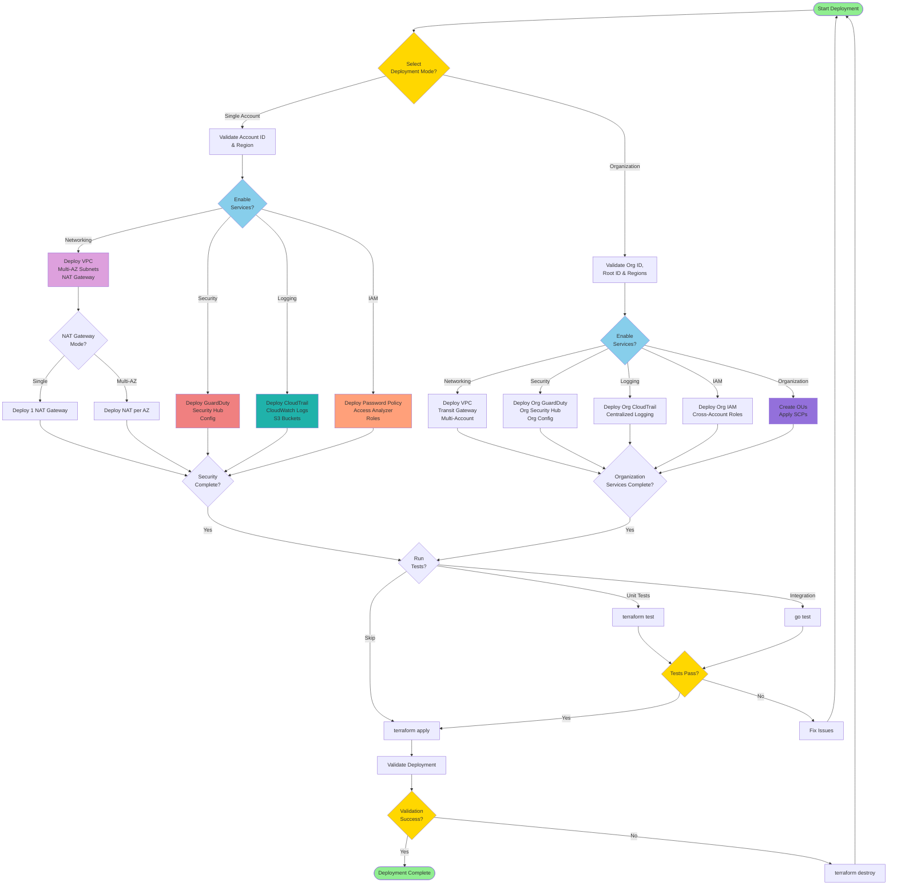
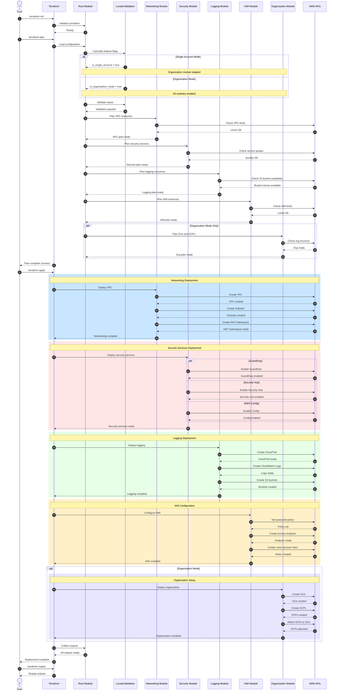
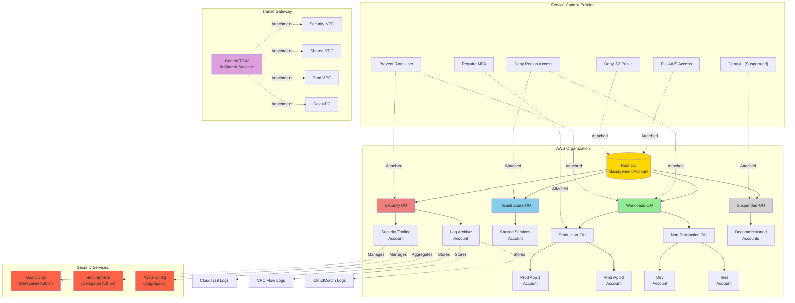
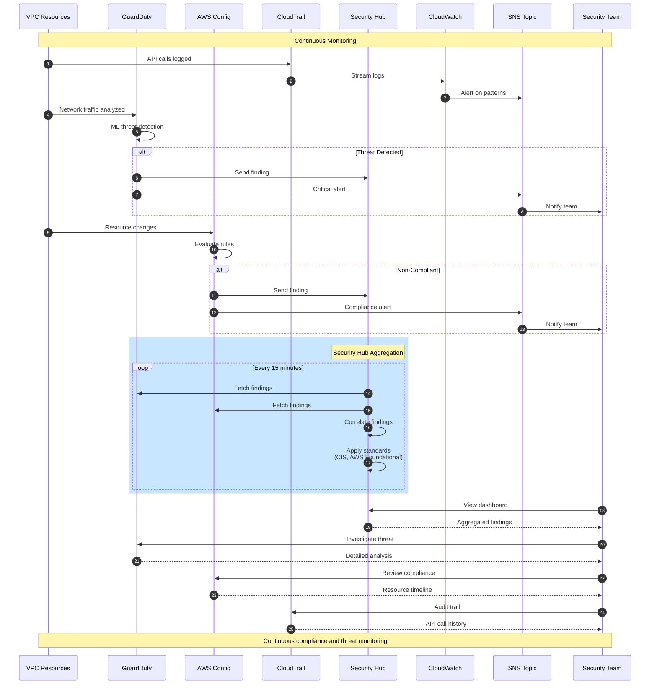

# AWS Cloud Landing Zone - Architecture Diagrams

This document contains comprehensive diagrams illustrating the architecture, deployment flow, and interactions within the AWS Cloud Landing Zone.

## Table of Contents

1. [Deployment Flow Diagram](#deployment-flow-diagram)
2. [Component Architecture Diagram](#component-architecture-diagram)
3. [Deployment Sequence Diagram](#deployment-sequence-diagram)
4. [Organization Mode Architecture](#organization-mode-architecture)
5. [Security Services Interaction](#security-services-interaction)

---

## Deployment Flow Diagram

This flowchart shows the decision flow and deployment process for the landing zone.



---

## Component Architecture Diagram

This C4 Component diagram shows the internal structure of the landing zone module.

```mermaid
C4Component
    title Component Diagram - AWS Cloud Landing Zone Module

    Container_Boundary(root, "Root Module") {
        Component(main, "Main Orchestrator", "Terraform", "Coordinates all submodules based on deployment mode")
        Component(locals, "Feature Flags", "Terraform Locals", "Calculates conditional logic and feature toggles")
        Component(validation, "Input Validator", "Terraform Variables", "Validates all input parameters")
    }

    Container_Boundary(networking, "Networking Module") {
        Component(vpc, "VPC Manager", "Terraform", "Creates VPC, subnets, route tables")
        Component(nat, "NAT Gateway", "Terraform", "Manages NAT Gateways (single/multi-AZ)")
        Component(tgw, "Transit Gateway", "Terraform", "Creates Transit Gateway for org mode")
        Component(endpoints, "VPC Endpoints", "Terraform", "S3 and DynamoDB endpoints")
    }

    Container_Boundary(security, "Security Module") {
        Component(guardduty, "GuardDuty", "Terraform", "Threat detection service")
        Component(securityhub, "Security Hub", "Terraform", "Central security findings")
        Component(config, "AWS Config", "Terraform", "Compliance monitoring")
        Component(macie, "Macie", "Terraform", "Data discovery (optional)")
    }

    Container_Boundary(logging, "Logging Module") {
        Component(cloudtrail, "CloudTrail", "Terraform", "API logging (org-aware)")
        Component(cloudwatch, "CloudWatch Logs", "Terraform", "Centralized log aggregation")
        Component(s3logs, "S3 Log Buckets", "Terraform", "Long-term log storage")
    }

    Container_Boundary(iam, "IAM Module") {
        Component(password, "Password Policy", "Terraform", "IAM password requirements")
        Component(analyzer, "Access Analyzer", "Terraform", "Detect unintended access")
        Component(roles, "Cross-Account Roles", "Terraform", "Security, admin, readonly roles")
    }

    Container_Boundary(org, "Organization Module") {
        Component(ous, "OU Manager", "Terraform", "Creates organizational units")
        Component(scps, "SCP Manager", "Terraform", "Creates and attaches SCPs")
    }

    System_Ext(aws, "AWS APIs", "AWS Cloud Services")

    Rel(main, locals, "Uses", "Calculates features")
    Rel(main, validation, "Uses", "Validates inputs")
    Rel(main, networking, "Deploys")
    Rel(main, security, "Deploys")
    Rel(main, logging, "Deploys")
    Rel(main, iam, "Deploys")
    Rel(main, org, "Deploys", "org mode only")

    Rel(vpc, aws, "Creates", "VPC API")
    Rel(nat, aws, "Creates", "EC2 API")
    Rel(tgw, aws, "Creates", "EC2 API")
    Rel(endpoints, aws, "Creates", "EC2 API")

    Rel(guardduty, aws, "Enables", "GuardDuty API")
    Rel(securityhub, aws, "Enables", "SecurityHub API")
    Rel(config, aws, "Enables", "Config API")
    Rel(macie, aws, "Enables", "Macie API")

    Rel(cloudtrail, aws, "Creates", "CloudTrail API")
    Rel(cloudwatch, aws, "Creates", "Logs API")
    Rel(s3logs, aws, "Creates", "S3 API")

    Rel(password, aws, "Sets", "IAM API")
    Rel(analyzer, aws, "Creates", "IAM API")
    Rel(roles, aws, "Creates", "IAM API")

    Rel(ous, aws, "Creates", "Organizations API")
    Rel(scps, aws, "Creates", "Organizations API")

    UpdateRelStyle(main, networking, $offsetY="-30")
    UpdateRelStyle(main, security, $offsetX="40")
    UpdateRelStyle(main, logging, $offsetX="-40")
    UpdateRelStyle(main, iam, $offsetY="30")
```

---

## Deployment Sequence Diagram

This sequence diagram shows the interaction between Terraform, the module, and AWS during deployment.



---

## Organization Mode Architecture

This diagram shows the multi-account organization structure.



---

## Security Services Interaction

This sequence diagram shows how security services interact and aggregate findings.



---

## Testing Flow

This flowchart shows the testing strategy for the module.

```mermaid
flowchart LR
    Start([Code Change]) --> PreCommit{Pre-commit<br/>Hooks}
    
    PreCommit -->|Format| TFFmt[terraform fmt]
    PreCommit -->|Validate| TFValidate[terraform validate]
    PreCommit -->|Lint| TFLint[tflint]
    PreCommit -->|Docs| TFDocs[terraform-docs]
    
    TFFmt --> LocalTest{Local<br/>Testing}
    TFValidate --> LocalTest
    TFLint --> LocalTest
    TFDocs --> LocalTest
    
    LocalTest -->|Unit Tests| UnitTest[terraform test]
    UnitTest --> UnitPass{Pass?}
    
    UnitPass -->|Yes| GitPush[git push]
    UnitPass -->|No| Fix1[Fix Issues]
    Fix1 --> Start
    
    GitPush --> PR[Create PR]
    
    PR --> CIChecks{CI/CD<br/>Checks}
    
    CIChecks --> CIFmt[Format Check]
    CIChecks --> CIValidate[Validate]
    CIChecks --> CILint[TFLint]
    CIChecks --> CITest[Unit Tests]
    CIChecks --> CISec[Checkov Security]
    
    CIFmt --> CIPass{All Pass?}
    CIValidate --> CIPass
    CILint --> CIPass
    CITest --> CIPass
    CISec --> CIPass
    
    CIPass -->|No| Fix2[Fix Issues]
    Fix2 --> Start
    
    CIPass -->|Yes| Merge[Merge to Main]
    
    Merge --> Nightly{Nightly<br/>Schedule}
    
    Nightly -->|2 AM UTC| IntTest[Integration Tests<br/>Terratest]
    IntTest --> Deploy[Deploy to AWS]
    Deploy --> Validate[Validate Resources]
    Validate --> Cleanup[Cleanup Resources]
    
    Cleanup --> IntPass{Pass?}
    IntPass -->|No| Issue[Create GitHub Issue]
    IntPass -->|Yes| Complete([Tests Complete])
    
    Issue --> Alert[Alert Team]
    Alert --> Complete
    
    style Start fill:#90EE90
    style Complete fill:#90EE90
    style UnitPass fill:#FFD700
    style CIPass fill:#FFD700
    style IntPass fill:#FFD700
    style Fix1 fill:#F08080
    style Fix2 fill:#F08080
    style Deploy fill:#87CEEB
    style Validate fill:#DDA0DD
```



---

## Usage Notes

### Viewing Diagrams

These Mermaid diagrams can be viewed:
1. **In GitHub**: Automatically rendered in markdown files
2. **In VS Code**: Use the Mermaid Preview extension
3. **Online**: Copy to [Mermaid Live Editor](https://mermaid.live/)

### Diagram Types

- **Flowchart**: Shows decision flows and processes
- **C4 Component**: Shows internal module structure
- **Sequence Diagram**: Shows time-ordered interactions
- **Organization Diagram**: Shows AWS account hierarchy

### Customization

To modify these diagrams:
1. Edit the mermaid code blocks
2. Test in Mermaid Live Editor
3. Commit changes to repository

### Related Documentation

- [README.md](../README.md) - Main module documentation
- [examples/](../examples/) - Deployment examples
- [SCP Examples](scp-examples.md) - Service Control Policies
