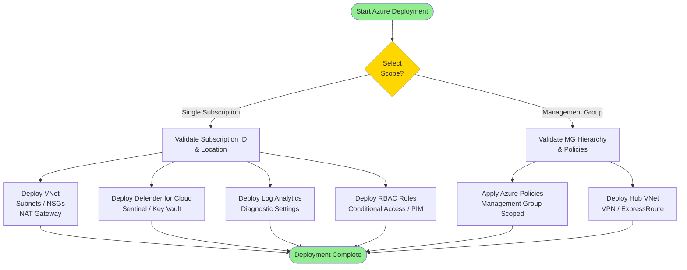

# Azure Cloud Landing Zone - Architecture Diagrams

> **Status: Placeholder** — diagrams will be populated once the Azure landing zone module is implemented.

## Planned Diagrams

1. [Deployment Flow Diagram](#deployment-flow-diagram)
2. [Component Architecture Diagram](#component-architecture-diagram)
3. [Management Group Hierarchy](#management-group-hierarchy)
4. [Security Services Interaction](#security-services-interaction)

---

## Deployment Flow Diagram



---

## Management Group Hierarchy

```
Tenant Root Group
└── Landing Zone
    ├── Platform
    │   ├── Identity
    │   ├── Management
    │   └── Connectivity
    └── Workloads
        ├── Production
        ├── Development
        └── Sandbox
```

---

## Azure Security Services

| Service | AWS Equivalent | Status |
|---------|---------------|--------|
| Microsoft Defender for Cloud | GuardDuty + Security Hub | Planned |
| Microsoft Sentinel | CloudWatch + Detective | Planned |
| Azure Policy | AWS Config Rules + SCPs | Planned |
| Azure Key Vault | AWS KMS | Planned |
| Azure AD / Entra ID | IAM + AWS SSO | Planned |
| Network Watcher | VPC Flow Logs | Planned |
| Log Analytics Workspace | CloudWatch Logs | Planned |
